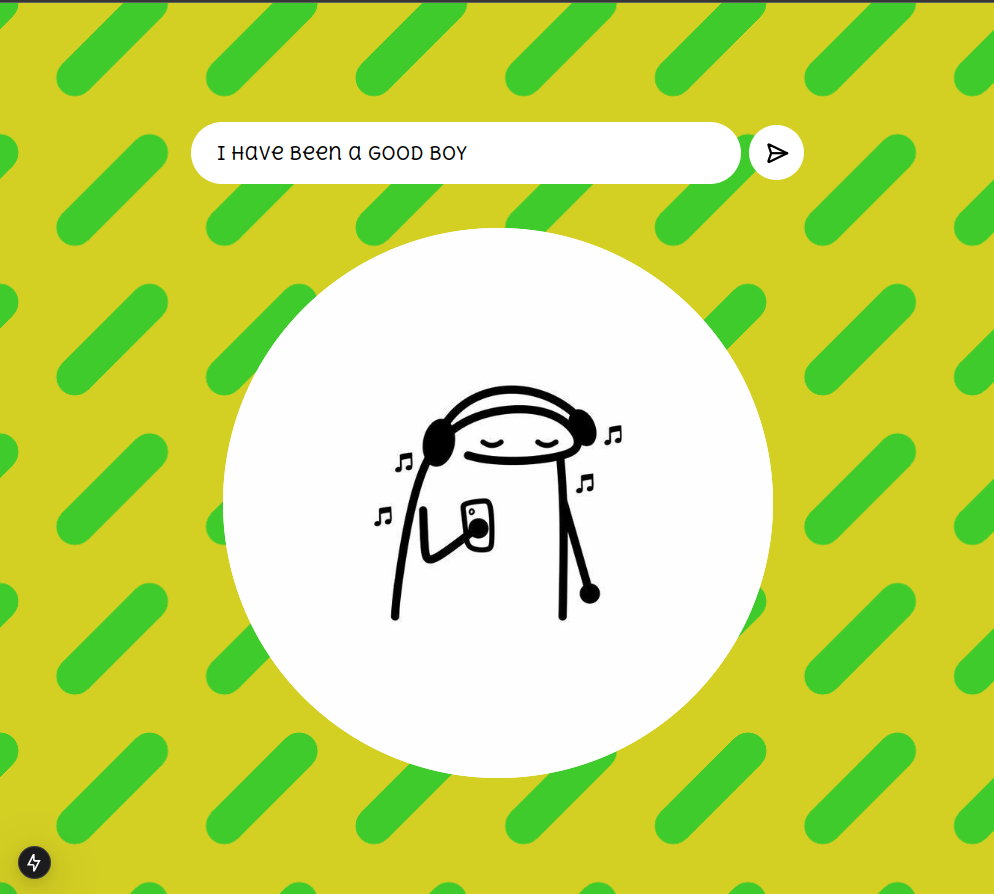

# Pookiemania by Aysha WITeee 🎯


## Basic Details
### Team Name: Segmentation Fault


### Team Members
- Team Lead: Febin Nelson P - RIT Kottayam
- Member 2: Abhiram Akosk - RIT Kottayam
- Member 3: Aysha Naruin - RIT Kottayam

### Project Description
Tell us your words and we will give you back a stickman figure that best explains your situation. Pookiemania is a fun project that generates stickman figures based on the words you provide. It's a fun way to express your emotions and situations in a creative way.

### The Problem (that doesn't exist)
We all had that issue where we couldn't express our emotions in words. Sometimes, words are not enough to explain our situations. That's where Pookiemania comes in. It generates stickman figures based on the words you provide. It's a fun way to express your emotions and situations in a creative way.

### The Solution (that nobody asked for)
So introducing Pookiemania, a fun project that generates stickman figures based on the words you provide. It's a fun way to express your emotions and situations in a creative way. Just type in your words and get a stickman figure that best explains your situation.

## Technical Details
### Technologies/Components Used
For Software:
- TypeScript, CSS, Tailwindcss
- Nextjs
- OpenAI API


### Implementation
For Software:
# Installation
```bash
npm install
```

# Run
```bash
npm run dev
```

# Screenshots (Add at least 3)



Made with ❤️ at TinkerHub Useless Projects


